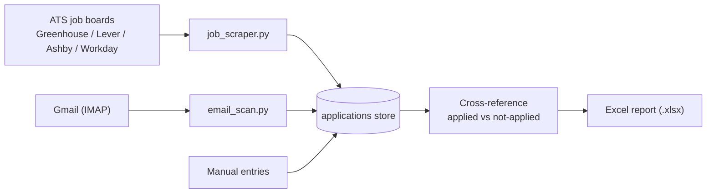

# Job Search Automation Toolkit

A small, dependency-light Python toolkit that turns a scattered job hunt into a single, queryable pipeline. It scans company job boards across multiple applicant-tracking systems, backfills your application history straight from your email inbox, and reconciles the two into one central tracker so you always know **which open roles you have not applied to yet**.

Built as a personal automation project; shared here as a portfolio piece.

## What it does

1. **Multi-ATS job scraping** - Discovers and pulls open postings from Greenhouse, Lever, Ashby, and Workday job boards, then filters them by role keywords (e.g. technical accounting, external reporting, controller).
2. **Email backfill** - Detects application-confirmation emails from ATS platforms, LinkedIn, Glassdoor, and recruiters to reconstruct everywhere you have already applied - regardless of the channel you applied through. Read either live over Gmail IMAP (`email_scan.py`) or from a credential-free Google Takeout `.mbox` export (`mbox_scan.py`).
3. **Central application tracker** - A single source-of-truth store that merges scraped openings, email-detected applications, and manual entries, with fuzzy same-company/time-window dedup, multi-source aggregation, and automatic status progression (applied -> viewed/reviewed -> interviewing -> offer/rejected) detected from follow-up emails.
4. **Cross-reference + flagging** - Tags every scraped opening as *already applied* or *not yet applied*, so the output is an actionable shortlist.
5. **Recruiter tracker** - A separate store of the people you are liaising with, auto-seeded from human email senders plus manual entries.
6. **Excel reporting** - Exports an `.xlsx` workbook with "Open Roles" (not-yet-applied rows highlighted), "My Applications" (with posting and email hyperlinks), and "Recruiters" sheets.



## Architecture

Two scraping pipelines cover the two ways companies publish jobs:

- **Pipeline A - ATS JSON APIs** (Greenhouse, Lever, Ashby). With `"ats": "auto"` the scraper derives candidate slugs from the company name and probes each ATS to auto-detect the right board.
- **Pipeline B - Workday** (direct career-page search endpoint). Set `"ats": "workday"` plus the `tenant` and `site` from the careers URL.

The email scanner and tracker are plain Python modules over the standard library, with `openpyxl` used only for Excel export.

## Project layout

```
scraper/
├── job_scraper.py     # Multi-ATS scraper + keyword filter + cross-reference
├── email_scan.py      # Gmail IMAP backfill -> application tracker
├── mbox_scan.py       # Google Takeout (.mbox) backfill -> application tracker (no credentials)
├── tracker.py         # Central applications store (load / upsert / fuzzy dedup / lookup)
├── recruiters.py      # Recruiter/contact store (auto-seeded + manual)
├── export_excel.py    # Excel (.xlsx) report generation
├── companies.json     # Target companies + role keywords (config)
├── .env.example       # Template for Gmail IMAP credentials
├── data/              # Application store (gitignored, local only)
└── reports/           # Generated reports (gitignored, local only)
```

## Setup

```bash
pip install -r requirements.txt        # only dependency: openpyxl
cp scraper/.env.example scraper/.env   # then fill in your Gmail credentials
```

To enable the email backfill, use a Gmail **App Password** (not your account password):

1. Enable IMAP in Gmail: Settings -> See all settings -> Forwarding and POP/IMAP -> Enable IMAP.
2. Create an App Password at <https://myaccount.google.com/apppasswords> (requires 2-Step Verification).
3. Put your address and the 16-character app password into `scraper/.env`.

If App Passwords aren't available on your account, skip the IMAP setup entirely and use the
credential-free **Google Takeout** route instead: export your mail at <https://takeout.google.com>
(select only "Mail"), unzip it, and run `mbox_scan.py --mbox <file>.mbox`.

## Usage

```bash
# Scrape all configured companies, cross-reference, and write reports
python scraper/job_scraper.py

# Scope the run
python scraper/job_scraper.py --group 1 2 3     # only certain company groups
python scraper/job_scraper.py --no-travel        # only no-travel-tagged companies
python scraper/job_scraper.py --only Ramp Stripe # specific companies

# Backfill application history from email (reads your inbox locally)
python scraper/email_scan.py --since 2024-01-01

# ...or backfill from a Google Takeout .mbox export (no app password needed)
python scraper/mbox_scan.py --mbox "All mail.mbox" --since 2024-01-01

# Export the current state to Excel
python scraper/export_excel.py
```

## Privacy

This repository is public and intentionally contains **code only**. All personal data - the career vault, application history, email content, resumes, generated reports, and credentials - is gitignored and never leaves your machine. See [.gitignore](.gitignore) for the full boundary.

## Notes

- Standard library only, except `openpyxl` for Excel output.
- The scraper hits public job-board endpoints; run it considerately.
- The email scanner runs locally under your own credentials; nothing is sent anywhere.
